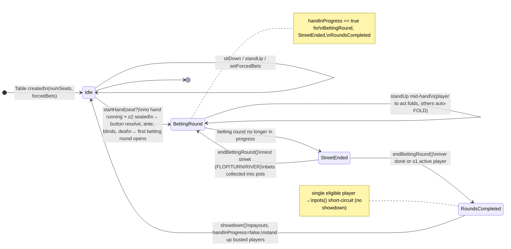
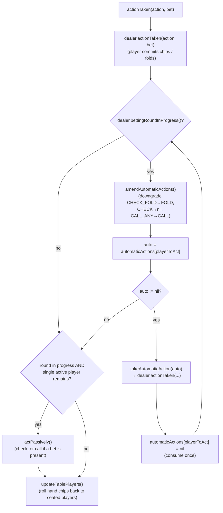

# 03 — Table Lifecycle

Source: `src/lib/table.ts`

The Table owns everything that spans hands. Per-hand mechanics live in the Dealer (04).

## State

- `_numSeats` (1–23), `_tablePlayers: [Player?]` (seated), `_handPlayers: [Player?]?` (per-hand clones).
- `_staged: [Bool]` — per seat, "changed since the current hand started" (sat down or stood up). Blocks that seat from hand-rollback updates and from automatic actions (which only exist for players in the hand since the start).
- `_automaticActions: [AutomaticAction?]` — bitmask enum, reset to all `nil` at hand start.
- `_forcedBets { ante?, blinds {small, big} }`, `_button`, `_firstTimeButton`, `_buttonSetManually`.
- `_deck`, `_communityCards`, `_dealer` (per-hand).

## Seat lifecycle

- `sitDown(seat, buyIn)`: seat must be empty → create `Player(buyIn)`, `_staged[seat] = true`. Legal any time, **including mid-hand** (a new player joins the table; they are excluded from the current hand by the `_staged` flag).
- `standUp(seat)`:
  - **Pre-hand:** just clears the seat.
  - **Mid-hand:** only the player to act may leave by folding (`actionTaken(FOLD)`); anyone else's leave is implemented as setting that player's automatic action to FOLD (`setAutomaticAction(seat, FOLD)`), so they fold when their turn comes. If only one active player remains afterward, that player acts passively (check/call, see below) to keep the hand moving.
  - **Post-showdown:** busted players (`total == 0`) are stood up automatically by `standUpBustedPlayers()`.

## Button placement (`incrementButton`, table.ts:392-414)

Three modes across hands:

1. `_firstTimeButton` (very first hand): button = first occupied seat (lowest index).
2. `_buttonSetManually` (`startHand(seat)` passed a seat): button = that seat if occupied, else first occupied seat. Manual set is one-shot — clears the flag after use.
3. Otherwise: rotate to the next occupied seat clockwise (wrap-around).

Heads-up special case in the Dealer (see 04): with exactly two players the button posts the small blind (button is the SB).

## Hand start (`startHand`, table.ts:101-122)

1. Preconditions: no hand in progress; ≥ 2 players seated.
2. Reset `_staged`, `_automaticActions`; clone `_tablePlayers` → `_handPlayers` (`Player(Player)` copy).
3. `incrementButton()` → deck `fillAndShuffle()` → new `CommunityCards` → new `Dealer(handPlayers, button, forcedBets, deck, communityCards)` → `dealer.startHand()` → `updateTablePlayers()`.

## Hand lifecycle state machine

## States and transitions

**States** (what the caller can observe via the predicates):

- **Idle** — `handInProgress() == false`. No Dealer. `winners()` holds the last hand's result (empty before any showdown). Only here can you `setForcedBets`.
- **BettingRound** — `handInProgress() && bettingRoundInProgress()`. `playerToAct()` / `legalActions()` / `actionTaken()` are valid.
- **StreetEnded** — `handInProgress() && !bettingRoundInProgress() && !bettingRoundsCompleted()`. Caller must call `endBettingRound()`. (`handPlayers()` etc. still valid.)
- **RoundsCompleted** — `handInProgress() && bettingRoundsCompleted()`. Caller must call `showdown()`. `holeCards()` still valid.

**Transitions** (trigger → effect, with preconditions):

| Transition | From → To | Effect / precondition |
|------------|-----------|------------------------|
| `sitDown(seat, buyIn)` | any → self | Seat must be empty; creates `Player`, sets `_staged[seat] = true`. Mid-hand joiners are excluded from the current hand by `_staged`. |
| `standUp(seat)` | Idle → self | Clears the seat. |
| `standUp(seat)` | BettingRound → self | Player-to-act folds (`actionTaken(FOLD)`); any other player is set to auto-FOLD; if one active player remains, `actPassively()` runs so the hand doesn't stall. |
| `startHand(seat?)` | Idle → BettingRound | Preconditions: no hand + ≥2 seated. Resolves the button (3 modes), then `Dealer.startHand`: ante → blinds → deal → first `BettingRound`. Edge: if ≤1 player can act, no round opens — the hand sits in StreetEnded immediately. |
| `actionTaken(action, bet)` | BettingRound → self | Commits chips or folds; resolves queued automatic actions; advances `playerToAct`; may flip `bettingRoundInProgress()` false. |
| `endBettingRound()` | StreetEnded → BettingRound / RoundsCompleted | Collects bets into pots (see 06); advances FLOP→TURN→RIVER, or completes when river done / ≤1 active player. |
| `showdown()` | RoundsCompleted → Idle | Pays winners, sets `handInProgress = false`, stands up busted players (`total == 0`). |

### actionTaken + automatic-action resolution

## Automatic actions

`AutomaticAction` bitmask: `FOLD=1<<0, CHECK_FOLD=1<<1, CHECK=1<<2, CALL=1<<3, CALL_ANY=1<<4, ALL_IN=1<<5`.

- **Who may set them:** `canSetAutomaticAction(seat)` = `!staged[seat] && tablePlayers[seat] != nil` — only original hand participants; and the player to act cannot set one.
- **Legal set** (`legalAutomaticActions`, table.ts:241-271): always `FOLD | ALL_IN`. If `biggestBet - betSize == 0` add `CHECK_FOLD | CHECK`, else add `CALL`. Add `CALL_ANY` only if `biggestBet < totalChips`.
- **Execution:** after each human `actionTaken`, while the betting round is still in progress and the player to act has an automatic action set, execute it (consume-once) and continue; otherwise stop (table.ts:176-187). `takeAutomaticAction` (table.ts:317-344) maps flags to concrete actions:
  - `CHECK_FOLD` → check if bet gap is 0, else fold; `CALL_ANY` → check if gap 0, else call; `ALL_IN` → if `total < biggestBet` call (match what's possible), else raise-all `total`.
- **Amendment** (`amendAutomaticActions`, table.ts:351-376) runs before each automatic execution and at street ends:
  - `CHECK_FOLD` with a bet in front → downgrade to `FOLD`.
  - `CHECK` with a bet in front → clear (nil).
  - `CALL_ANY` when `biggestBet ≥ totalChips` → downgrade to `CALL`.
  - (A commented-out branch shows `CALL` under contest was considered and intentionally disabled — do not "fix" this.)

## Passive play (check/call)

`actPassively()` (table.ts:381-390): when only one active (non-staged) player remains in a betting round, that player must act: **check if `BET` is in their legal actions, else call**. This keeps automatic FOLDs from stalling the hand. Applied both after `actionTaken` and after `standUp` mid-hand.

## Chip-state rollback (`updateTablePlayers`, `clearFoldedBets`)

- `updateTablePlayers` (after every mutation): for seats not `_staged`, copy the hand player into the table player.
- `clearFoldedBets` (after `endBettingRound`): a **folded** hand player (nil in hand roster) whose table player still has a bet outstanding gets a fresh `Player(stack)` — because folded bets were moved into the pot by the PotManager, the table player must not keep showing a bet. `_staged` seats are skipped (their chips were never in the hand).

## Public state queries (all precondition-guarded)

`playerToAct`, `button`, `handPlayers`, `numActivePlayers`, `pots`, `roundOfBetting`, `communityCards`, `holeCards`, `legalActions` (see 04 for derivation), `winners` (valid only after hand ends; empty before any showdown).
