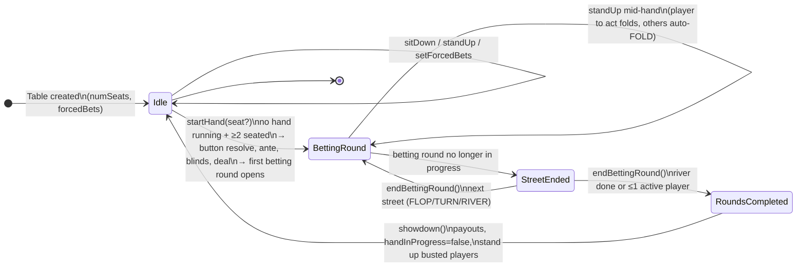

# 03 — Table lifecycle

Source: `OpenGamblePoker/Table.swift`

The Table owns everything that spans hands. Per-hand mechanics live in the Dealer (04).

## State

- `_numSeats` (1–23), `_tablePlayers: SeatArray` (seated), `_staged: [Bool]`.
- `_automaticActions: [AutomaticAction?]` — `AutomaticAction` is an `OptionSet` (`fold, checkFold, check, call, callAny, allIn`), reset to all `nil` at hand start.
- `_forcedBets`, `_button`, `_firstTimeButton`, `_buttonSetManually`, `_deck`, `_dealer: Dealer?` (per-hand).
- **No `_handPlayers` snapshot** — the dealer's `bettingRoundPlayers()` (`_players`) is the source of truth (01).

## Seat lifecycle

- `sitDown(_ seat:_ buyIn:)`: seat must be empty → create `Player`, set `_staged[seat] = true`. Legal any time, **including mid-hand** (a new player joins; excluded from the current hand by `_staged`).
- `standUp(_ seat:)`:
  - **Pre-hand:** clears the seat.
  - **Mid-hand:** only the player to act may leave by folding (`actionTaken(.fold)`); anyone else in the hand is set to automatic FOLD (`setAutomaticAction(_:._fold)`). If only one active player remains, `actPassively()` runs so the hand doesn't stall.
  - **Post-showdown:** busted players (`total == 0`) are stood up automatically by `standUpBustedPlayers()`.

## Button placement (`incrementButton`, Table.swift:377)

Three modes across hands:

1. `_firstTimeButton` (very first hand): button = first occupied seat (lowest index).
2. `_buttonSetManually` (`startHand(seat:)` passed a seat): button = that seat if occupied, else first occupied seat. Manual set is one-shot — clears the flag after use. **Guard the index**: `_button < count && _tablePlayers[_button] != nil` (a manual seat beyond the array, e.g. `10` on a 9-seat table, must fall back, not trap).
3. Otherwise: rotate to the next occupied seat clockwise (wrap-around).

Heads-up special case in the Dealer (04): with exactly two players the button posts the small blind (button is the SB).

## Hand start (`startHand(seat:)`, Table.swift:96)

1. Preconditions: no hand in progress; ≥ 2 players seated.
2. Reset `_staged`, `_automaticActions`; resolve `incrementButton()` → `_deck.fillAndShuffle()` → build a fresh `Dealer(players: _tablePlayers, button:, forcedBets:, deck:, communityCards:, numSeats:)` → `dealer.startHand()` → `updateTablePlayers()`.

## Hand lifecycle state machine



## States and transitions

**States** (observed via predicates):

- **Idle** — `handInProgress() == false`. No live hand. `winners()` holds the last hand's result. Only here can you `setForcedBets`.
- **BettingRound** — `handInProgress() && bettingRoundInProgress()`. `playerToAct()` / `legalActions()` / `actionTaken()` are valid.
- **StreetEnded** — `handInProgress() && !bettingRoundInProgress() && !bettingRoundsCompleted()`. Caller must call `endBettingRound()`.
- **RoundsCompleted** — `handInProgress() && bettingRoundsCompleted()`. Caller must call `showdown()`.

**Transitions** (trigger → effect, with preconditions): `sitDown`/`standUp` (any → self), `startHand` (Idle → BettingRound), `actionTaken` (BettingRound → self, resolves queued automatic actions), `endBettingRound` (StreetEnded → BettingRound / RoundsCompleted), `showdown` (RoundsCompleted → Idle).

### actionTaken + automatic-action resolution

```
actionTaken(action, bet)
  → dealer.actionTaken(action, bet)          // player commits chips / folds
  → while dealer.bettingRoundInProgress():
        amendAutomaticActions()              // downgrade CHECK_FOLD→FOLD, CHECK→nil, CALL_ANY→CALL
        auto = automaticActions[playerToAct]
        if auto != nil: takeAutomaticAction(auto); automaticActions[playerToAct] = nil
        else: break
  → if bettingRoundInProgress() && singleActivePlayerRemaining(): actPassively()  // check, else call
  → updateTablePlayers()
```

## Automatic actions

`AutomaticAction` bitmask: `fold=1<<0, checkFold=1<<1, check=1<<2, call=1<<3, callAny=1<<4, allIn=1<<5`.

- **Who may set them:** `canSetAutomaticAction(seat)` = `!staged[seat] && tablePlayers[seat] != nil` — only original hand participants; and the player to act cannot set one.
- **Legal set** (`legalAutomaticActions`, Table.swift:193): always `fold | allIn`. If `biggestBet - betSize == 0` add `checkFold | check`, else add `call`. Add `callAny` only if `biggestBet < totalChips`.
- **Execution:** after each human `actionTaken`, while the round is in progress and the player to act has an automatic action set, execute it (consume-once) and continue; otherwise stop. `takeAutomaticAction` maps flags to concrete actions:
  - `checkFold` → check if bet gap is 0, else fold; `callAny` → check if gap 0, else call; `allIn` → if `total < biggestBet` call (match what's possible), else raise-all `total`.
- **Amendment** (`amendAutomaticActions`, Table.swift:318) runs before each automatic execution and at street ends:
  - `checkFold` with a bet in front → downgrade to `fold`.
  - `check` with a bet in front → clear (nil).
  - `callAny` when `biggestBet ≥ totalChips` → downgrade to `call`.
  - (A `CALL`-under-contest downgrade is intentionally **not** implemented — do not add it.)

## Passive play (check/call)

`actPassively()` (Table.swift:343): when only one active (non-staged) player remains in a betting round, that player must act: **check if `BET` is in their legal actions, else call**. This keeps automatic FOLDs from stalling the hand. Applied both after `actionTaken` and after `standUp` mid-hand.

## Chip-state rollback (`updateTablePlayers`, `clearFoldedBets`)

- `updateTablePlayers` (after every mutation): for seats not `_staged`, copy the hand player from `dealer.bettingRoundPlayers()` into the table player.
- `clearFoldedBets` (after `endBettingRound`): a **folded** hand player whose table player still has a bet outstanding gets a fresh `Player(total: stack)` — because folded bets were moved into the pot by the PotManager, the table player must not keep showing a bet. `_staged` seats are skipped.

## Public state queries (all precondition-guarded)

`playerToAct`, `button`, `seats`, `handPlayers`, `numActivePlayers`, `pots`, `forcedBets`, `numSeats`, `roundOfBetting`, `communityCards`, `holeCards`, `legalActions`, `winners` (valid only after hand ends), `automaticActions`, `canSetAutomaticAction`, `legalAutomaticActions`.
