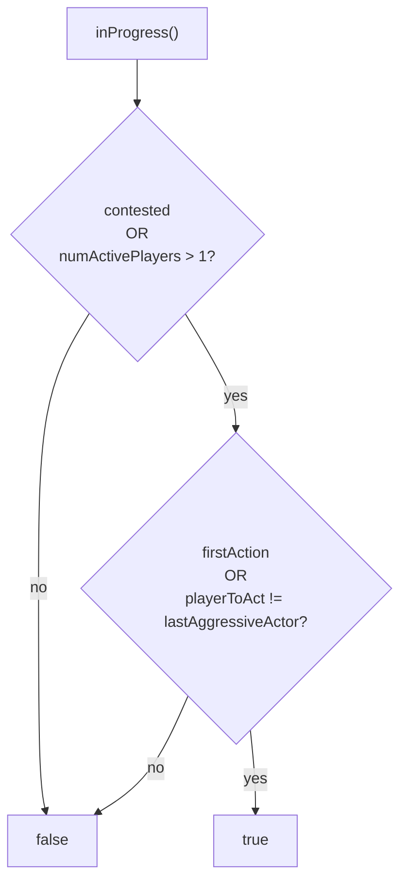
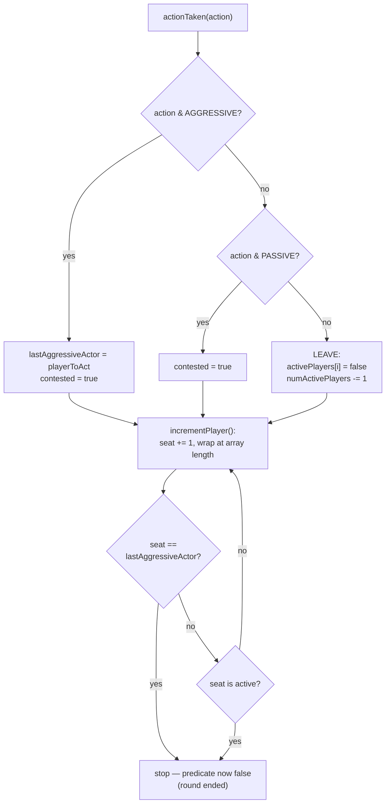
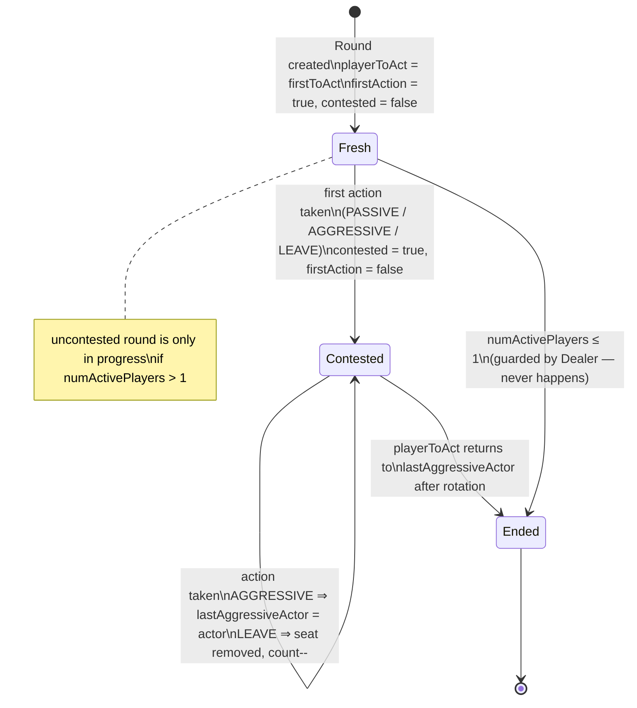
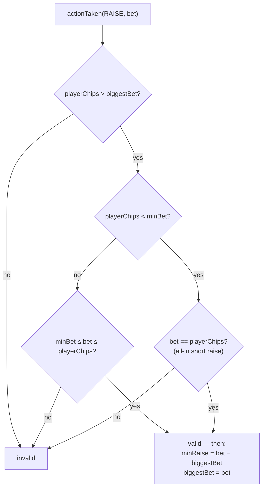

# 05 — Round and BettingRound

Source: `src/lib/round.ts`, `src/lib/betting-round.ts`

Two classes. `Round` is a pure rotation/continuation state machine; `BettingRound` adds chip amounts and raise validation. One `Round` (inside one `BettingRound`) per street.

## Round state

- `activePlayers: [Bool]` — who is still in the current street (folded/all-in leave).
- `playerToAct: SeatIndex`, `lastAggressiveActor: SeatIndex`.
- `contested: Bool` — set on the first action of any kind (passive or aggressive); **uncontested** means nobody has acted yet (can only happen preflop for the big blind or heads-up edges).
- `firstAction: Bool`.
- `numActivePlayers`.

## In-progress predicate (the heart of the machine)

```
inProgress = (contested || numActivePlayers > 1)
          && (firstAction || playerToAct != lastAggressiveActor)
```

- `(contested || numActivePlayers > 1)`: a round where only one player remains is never "in progress" once they've acted (`contested == true` then) — but with a single player and no action yet (firstAction), it can still be in progress (e.g. a lone all-in blind waiting to be matched… actually the round still needs the player to act).
- `(firstAction || playerToAct != lastAggressiveActor)`: the round ends when play cycles back to the last aggressor (or to the first actor in uncontested rounds). In an uncontested round with >1 player, play ends when the first actor's turn comes again (everyone else checked/called).



## Action handling (`actionTaken`, round.ts:51-73)

- `LEAVE (1<<0)` — player is out (fold or all-in), `activePlayers[i] = false`, count down.
- `PASSIVE (1<<1)` — match (check/call); sets `contested = true`.
- `AGGRESSIVE (1<<2)` — bet/raise; sets `lastAggressiveActor = i`, `contested = true`.
- After any action: advance to the **next active player**, wrapping; stop if you land on `lastAggressiveActor` (which is why inProgress flips false). A single action may carry multiple flags (e.g. all-in raise = `AGGRESSIVE|LEAVE`).

**Rotation algorithm** (round.ts:75-81): increment seat, wrap at array length, break if the new seat is `lastAggressiveActor`, repeat while the seat is inactive. This is exactly "clockwise to the next player who can act".





## BettingRound (adds chips)

Constructor: `(players, firstToAct, minRaise, biggestBet = 0)`. Preflop `minRaise = bigBlind`, `biggestBet = bigBlind` (the posted BB bet is the standing bet). Postflop: `minRaise = bigBlind`, `biggestBet = 0`.

### Legal actions for the player to act

```
canRaise = player.totalChips > biggestBet
if canRaise:
    minBet  = biggestBet + minRaise        # smallest raise-to amount
    chipRange = [min(minBet, total), total] # all-in "mini-raise" is allowed
else:
    chipRange = none (raise impossible)
```

Note: the min-raise "size" isn't tracked as a raise-amount limit; the legal **bet-to** range is `[biggestBet + minRaise, total]`. `minRaise` itself is updated after each raise (`minRaise = bet - previousBiggestBet`, betting-round.ts:94) so the *raise increment* must be ≥ the previous increment (no under-raises).

### Action execution (`actionTaken`, betting-round.ts:88-112)

- `RAISE`: validate (see below) → `player.bet(bet)` → `minRaise = bet - biggestBet`, `biggestBet = bet` → Round action `AGGRESSIVE` (+ `LEAVE` if `stack == 0` after).
- `MATCH`: `player.bet(min(biggestBet, total))` → `PASSIVE` (+ `LEAVE` if stack 0).
- `LEAVE`: Round `LEAVE` (fold path — chip handling done by the Dealer).

### Raise validation (betting-round.ts:114-123)

```
playerChips = stack + betSize            # total, invariant
minBet = biggestBet + minRaise
if playerChips > biggestBet && playerChips < minBet:
    valid ⇔ bet == playerChips           # all-in "short" raise is the only legal one
else:
    valid ⇔ minBet ≤ bet ≤ playerChips
```

So: a raise must reach `biggestBet + minRaise` **unless the player is all-in for less** (short raise). The all-in short raise also updates `minRaise` and `biggestBet` like any raise — subsequent raisers must still clear `newBiggestBet + newMinRaise`, which keeps the previous (full) minimum in effect.



### Player-array reconstruction

`players()` maps the Round's active mask back to `[Player?]` (nil for inactive). This is what the Dealer uses as the next street's roster, which is how folded/all-in players drop out permanently.
